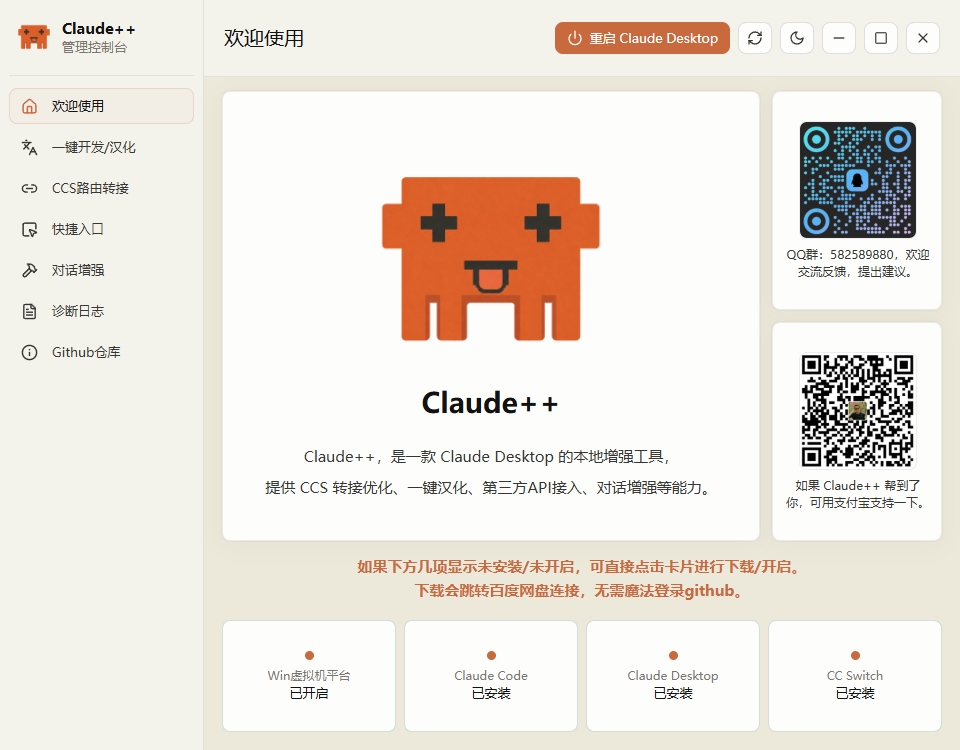
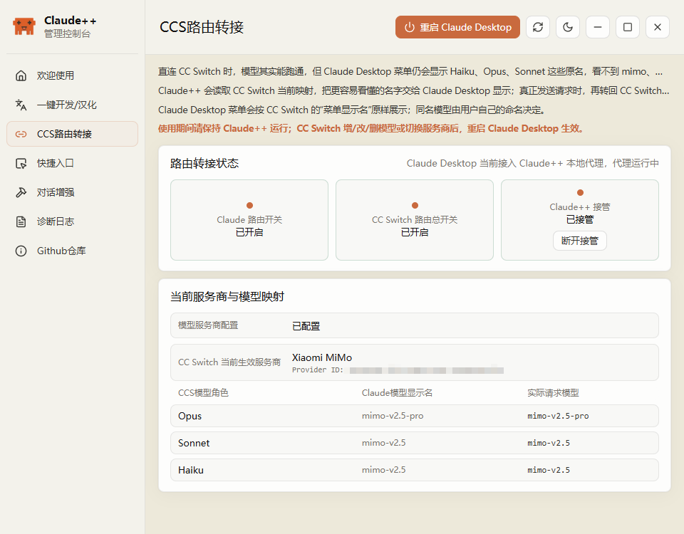
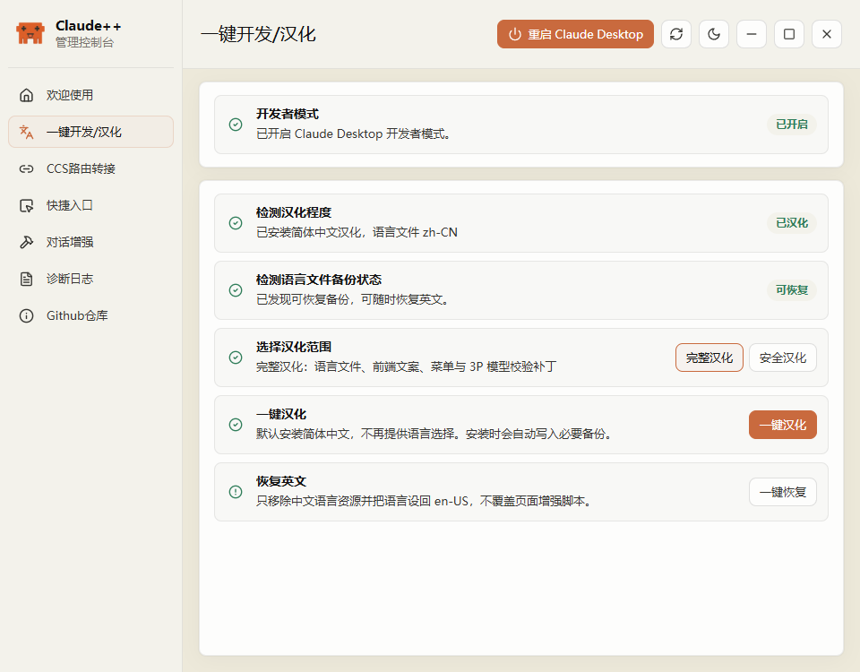
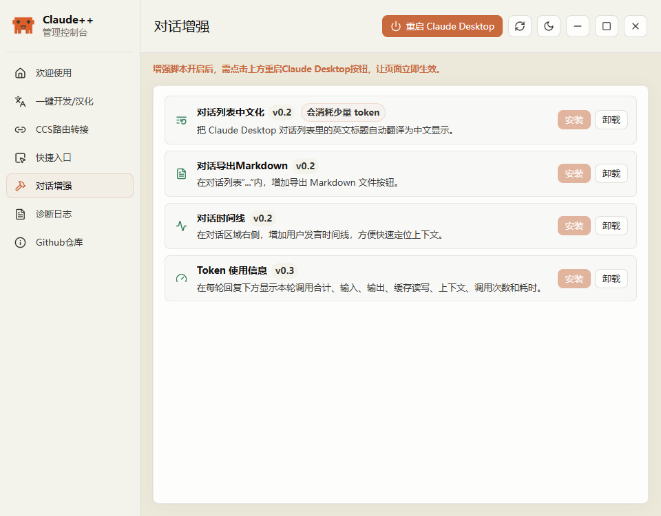
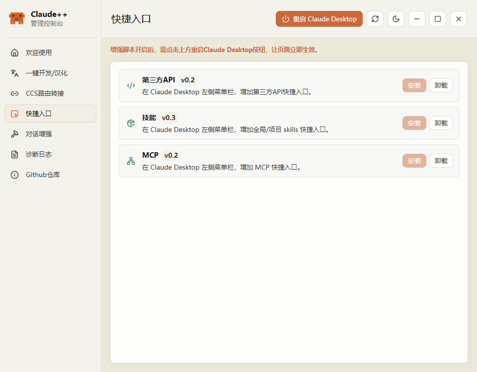
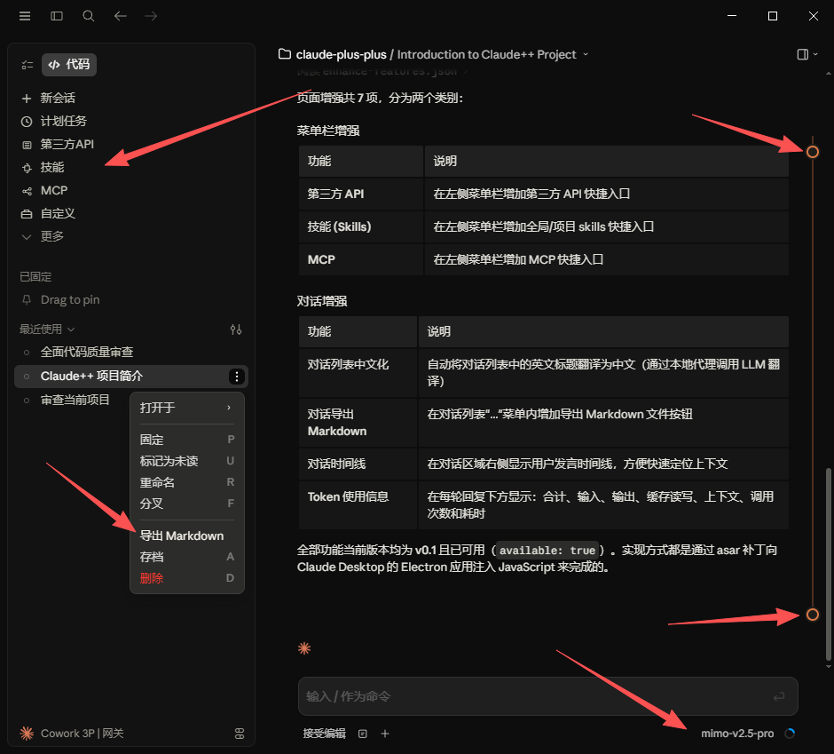

# Claude++

<p align="center">
  
</p>

<p align="center">
  <a href="#中文">中文</a> | <a href="#english">English</a>
</p>

<p align="center">
  <a href="https://github.com/laoguo2025/claude-plus-plus/releases/latest"></a>
  <a href="https://github.com/laoguo2025/claude-plus-plus/stargazers"></a>
  <a href="LICENSE"></a>
  
  
  
</p>

Claude++ 是一个 Claude Desktop 本地增强控制台，专注页面增强、汉化、token 用量、Markdown 导出、Skills/MCP 快捷入口。
它还支持 CC Switch 模型名桥接、可逆接管、诊断日志和跨平台安装包。

---

## 中文

### 快速下载

前往 [GitHub Releases](https://github.com/laoguo2025/claude-plus-plus/releases/latest) 下载最新版安装包。

| 平台 | 安装包 |
| --- | --- |
| Windows x64 | `Claude++_1.0.1_x64_setup.exe` |
| macOS Apple Silicon | `Claude++_1.0.1_arm64.dmg` |
| macOS Intel | `Claude++_1.0.1_x64.dmg` |

### 1.0.1 更新内容

- 新增 Win 虚拟机平台自动开启。
- 新增一键开启 Claude Desktop 开发者模式。
- 优化一键汉化/恢复、启动状态检测、路由桥接、UI 布局、部分路径和诊断日志。
- 修复了一些 bug。

### macOS 未签名提示

当前 macOS DMG 是未签名构建。因为项目暂未使用 Apple Developer ID 签名和公证，首次打开时 macOS 可能提示“无法验证开发者”。如需继续使用，请右键点击 `Claude++.app` 选择“打开”，或在“系统设置 -> 隐私与安全性”中选择“仍要打开”。

### 这是什么

Claude++ 是一个面向 Claude Desktop 的本地增强控制台。它把常用的 Claude Desktop 改造能力集中到一个 Tauri 桌面应用里：安装页面增强、查看 token 用量、导出 Markdown、增加 Skills / MCP / 第三方 API 入口、安装简体中文资源、接入 CC Switch 模型路由，并在出问题时生成诊断报告。

它不是云服务，也不接管你的上游账号。Claude++ 运行在本机，按需修改 Claude Desktop 本地资源或配置；路由桥接场景下，它只读 CC Switch 配置并把请求继续转发给 CC Switch。

### 核心功能

- **页面增强优先**：为 Claude Desktop 增加第三方 API、Skills、MCP 快捷入口，并支持对话标题中文化、Markdown 导出、对话时间线和 token 使用信息。
- **一键汉化与恢复**：安装简体中文语言资源，保留备份，并支持恢复英文。
- **CC Switch 转接**：让 Claude Desktop 3P 模型菜单显示 CC Switch 的自定义模型名，同时保持真实请求仍回到 CC Switch 路由。
- **本地代理与可逆接管**：默认监听 `127.0.0.1:15722`，写入独立的 Claude++ 配置条目，不覆盖 CC Switch 原始条目，可随时断开接管。
- **环境准备检查**：检测 Claude Code、Claude Desktop、开发者模式、CC Switch 状态，并提供快捷安装/开启入口。
- **诊断与排查**：读取本地日志，生成包含路由、模型映射、汉化、增强状态的诊断报告。
- **跨平台分发**：提供 Windows 安装包和 macOS Apple Silicon / Intel DMG。

### 使用方式

#### 1. 准备环境



欢迎页会检查 Claude Code、Claude Desktop、开发者模式和 CC Switch。缺少组件时，可以直接从卡片入口下载或开启。

#### 2. 接入 CC Switch 路由



在「CCS转接」页查看 CC Switch 路由开关、Claude++ 接管状态和当前模型映射。接管后，Claude Desktop 菜单显示 CC Switch 的自定义模型名；实际请求仍按 CC Switch 的角色和上游配置发送。

#### 3. 安装或恢复中文化



在「一键汉化」页安装简体中文资源，选择完整汉化或安全汉化；如果需要回退，可以从备份恢复英文资源。

#### 4. 管理 Claude Desktop 页面增强



在「页面增强」页安装或卸载增强项。当前支持第三方 API、Skills、MCP 入口，对话列表中文化，Markdown 导出，对话时间线和 token 使用信息。安装后重启 Claude Desktop 即可生效。

#### 5. 管理快捷入口



在「快捷入口」页安装或卸载第三方 API、Skills 和 MCP 菜单入口。增强脚本开启后，点击顶部「重启 Claude Desktop」即可让页面立即生效。

#### 6. 查看诊断与版本

「诊断日志」页用于生成诊断报告和复制最近日志；「Github仓库」页用于查看当前 Claude++ / Claude Desktop 版本，并跳转到仓库和 Release。

### 效果展示



### 构建

需要环境：

- Rust stable
- Node.js 22 + npm
- Windows：Visual Studio Build Tools C++ 工作负载与 WebView2
- macOS：Xcode Command Line Tools

开发运行：

```bash
npm install
npx tauri dev
```

前端构建检查：

```bash
npm run build
```

Windows 发布构建：

```bat
build-release.bat
```

macOS DMG 构建示例：

```bash
npm ci
npx tauri build --bundles dmg --target aarch64-apple-darwin --no-sign
npx tauri build --bundles dmg --target x86_64-apple-darwin --no-sign
```

`--no-sign` 生成的 DMG 仅适合测试或开源分发，用户首次打开时需要按上面的 macOS 未签名提示手动放行。正式免拦截分发需要 Apple Developer ID 签名和公证。

### 路线图

- [x] Claude Desktop 页面增强安装与卸载
- [x] Skills / MCP / 第三方 API 菜单入口
- [x] 对话标题中文化、Markdown 导出、对话时间线、token 使用信息
- [x] Claude Desktop 简体中文安装、备份和恢复
- [x] CC Switch 3P 模型名桥接与可逆接管
- [x] 诊断报告、日志查看和复制
- [x] Windows 与 macOS 安装包
- [ ] 自动更新与版本检查
- [ ] 更多 Claude Desktop 页面增强项
- [ ] 更完整的配置导出与恢复

### 技术栈

Claude++ 使用 Tauri 2 构建桌面外壳，React + TypeScript 构建控制台界面，Rust 负责本地命令、文件补丁、诊断、代理服务和 CC Switch SQLite 读取。代理侧使用 axum、reqwest、rusqlite 等库完成 HTTP 转发、模型发现和本地状态读取。

### License

[MIT](LICENSE)

> 本项目与 Anthropic、Claude、CC Switch 官方无关。请仅在你了解本地资源修改和第三方路由配置影响的前提下使用。

---

## English

### Download

Download the latest installers from [GitHub Releases](https://github.com/laoguo2025/claude-plus-plus/releases/latest).

| Platform | Installer |
| --- | --- |
| Windows x64 | `Claude++_1.0.1_x64_setup.exe` |
| macOS Apple Silicon | `Claude++_1.0.1_arm64.dmg` |
| macOS Intel | `Claude++_1.0.1_x64.dmg` |

### 1.0.1 Changes

- Added automatic enablement for the Windows virtual machine platform.
- Added one-click Claude Desktop developer mode enablement.
- Improved Chinese localization install/restore, startup status detection, route bridging, UI layout, path handling, and diagnostics logs.
- Fixed several bugs.

### macOS unsigned build notice

The current macOS DMGs are unsigned builds. Because the project is not yet signed and notarized with an Apple Developer ID, macOS may show an "unidentified developer" warning on first launch. To continue, right-click `Claude++.app` and choose "Open", or allow it from "System Settings -> Privacy & Security".

### What is this

Claude++ is a local enhancement console for Claude Desktop. It brings the practical desktop tweaks into one Tauri app: page enhancements, token usage display, Markdown export, Skills / MCP / third-party API shortcuts, Simplified Chinese localization, CC Switch model routing, and diagnostics.

It is not a cloud service and it does not take over your upstream accounts. Claude++ runs locally, patches Claude Desktop resources or config only when you ask it to, and in the routing flow it reads CC Switch config read-only before forwarding requests back to CC Switch.

### Features

- **Page enhancements first**: add third-party API, Skills, and MCP shortcuts to Claude Desktop, plus conversation title localization, Markdown export, conversation timeline, and token usage details.
- **Chinese localization**: install Simplified Chinese resources, keep backups, and restore English when needed.
- **CC Switch bridge**: show CC Switch custom model names in the Claude Desktop 3P model picker while keeping the actual request routing unchanged.
- **Local proxy with reversible takeover**: listens on `127.0.0.1:15722`, writes a separate Claude++ config entry, avoids overwriting the CC Switch entry, and can be disconnected at any time.
- **Environment checks**: detect Claude Code, Claude Desktop, developer mode, and CC Switch, with quick install or enable actions.
- **Diagnostics**: read local logs and generate a report covering routing, model mappings, localization, and enhancement status.
- **Cross-platform installers**: Windows installer plus macOS Apple Silicon / Intel DMGs.

### Usage

#### 1. Prepare the environment


The welcome page checks Claude Code, Claude Desktop, developer mode, and CC Switch. Missing pieces can be installed or enabled from the cards.

#### 2. Connect CC Switch routing


The CCS bridge page shows the CC Switch route switch, Claude++ takeover state, and current model mappings. After takeover, Claude Desktop shows CC Switch custom model names while requests still go through the original CC Switch roles and upstream configuration.

#### 3. Install or restore localization


The localization page installs Simplified Chinese resources, supports complete or safer patch scopes, and restores English from backups when needed.

#### 4. Manage Claude Desktop page enhancements


The enhancement page installs or removes Claude Desktop tweaks: third-party API, Skills, MCP shortcuts, conversation title localization, Markdown export, conversation timeline, and token usage display. Restart Claude Desktop after installation to apply them.

#### 5. Manage shortcuts


The shortcuts page installs or removes the third-party API, Skills, and MCP menu entries. After enabling enhancement scripts, click "Restart Claude Desktop" at the top to apply them immediately.

#### 6. Check diagnostics and version

The diagnostics page generates reports and copies recent logs. The GitHub page shows the current Claude++ / Claude Desktop versions and links to the repository and Releases.

### Effect Preview


### Build

Prerequisites:

- Rust stable
- Node.js 22 + npm
- Windows: Visual Studio Build Tools with the C++ workload and WebView2
- macOS: Xcode Command Line Tools

Development:

```bash
npm install
npx tauri dev
```

Frontend build check:

```bash
npm run build
```

Windows release build:

```bat
build-release.bat
```

macOS DMG build:

```bash
npm ci
npx tauri build --bundles dmg --target aarch64-apple-darwin --no-sign
npx tauri build --bundles dmg --target x86_64-apple-darwin --no-sign
```

DMGs built with `--no-sign` are suitable for testing or open-source distribution, but users need to manually allow the app on first launch. Public distribution without that warning requires Apple Developer ID signing and notarization.

### Roadmap

- [x] Claude Desktop page enhancement install and uninstall
- [x] Skills / MCP / third-party API shortcuts
- [x] Conversation title localization, Markdown export, conversation timeline, token usage display
- [x] Claude Desktop Simplified Chinese install, backup, and restore
- [x] CC Switch 3P model-name bridge with reversible takeover
- [x] Diagnostics report, log viewer, and copy actions
- [x] Windows and macOS installers
- [ ] Auto update and version checks
- [ ] More Claude Desktop page enhancements
- [ ] Fuller config export and restore

### Tech Stack

Claude++ uses Tauri 2 for the desktop shell, React + TypeScript for the console UI, and Rust for local commands, file patching, diagnostics, proxy service, and CC Switch SQLite reads. The proxy side uses axum, reqwest, rusqlite, and related crates for HTTP forwarding, model discovery, and local state inspection.

### License

[MIT](LICENSE)

> This project is not affiliated with Anthropic, Claude, or CC Switch. Use it only when you understand the impact of local resource patches and third-party routing configuration.

